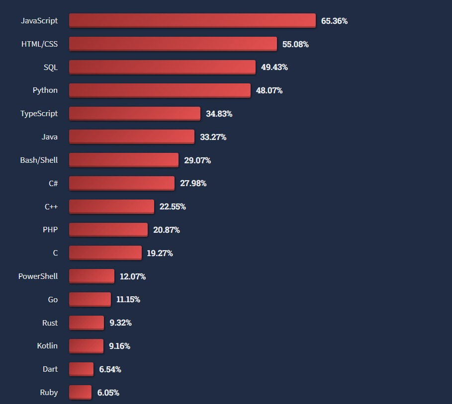

在開始學習 JavaScript 之前，我們先來回答一些關於 JavaScript 的基本知識，像是 "JavaScript 是甚麼?"、"JavaScript 可以幹嘛" ... 等等。

# JavaScript 是甚麼？

JavaScript 是一個門程式語言，相較於其它程式語言，JavaScript 是目前成長最快且受歡迎的一門程式語言，可以從 stackoverflow 提供的統計數據看出來，JavaScript 是 2022 最受歡迎的程式語言，這代表我們學 JavaScript 是相對容易找到工作的。

## JavaScript 可以幹嘛
在現在有大量社群支持的情況下，JS 可以用來製作網頁前端程式(運行在瀏覽器)、網頁後端程式(運行在伺服器)、手機程式、能即時通訊的網路應用程式，甚至是製作遊戲都行，可以說 JS 的應用層面非常廣。

## JavaScript 程式碼在哪裡執行？
JS 在**一開始**被設計只能在瀏覽器運行，所以每個瀏覽器都會有**JavaScript 引擎**，用來執行 JS 程式碼，例如 google chrome 的 JS 引擎叫做 V8，FireFox 的 JS 引擎叫做 SpiderMonkey。其它瀏覽器不見得會自己製作自己的 JS 引擎，也有可能直接使用已經被製作好的 Chrome V8 引擎。

到了後來，有大神在 Chrome V8 引擎的基礎上，製作出了 Node.js，讓 JS 也能運行在伺服器端，所以現在 JS 可以撐起整個網頁程式了。

隨著技術的發展，JS 已經能在各種場景使用，成為一門非常流行和重要的程式語言。

## JavaScript 和 ECMAScript(ES) 的差別是什麼？
在之後學 JavaScript 的過程，會常常看到像 ES5、ES6 等名詞，這個 ES 就是 EMCAScript，他是 JavaScript 的規範，定義了 JS 的語法等細節，為甚麼要特定規範 JS ，是因為要確保在我們在不同的環境下都能順利運行 JS，而現在最新的 ES 規範是 ESMAScript 2022。

## 學習 JavaScript 的資源
在最後推薦幾個學習 JavaScript 的免費資源：
1. [W3S](https://www.w3schools.com/js/default.asp)
2. [MDN](https://developer.mozilla.org/zh-TW/docs/Learn/JavaScript)
3. [菜鳥教程](https://www.runoob.com/js/js-tutorial.html)

這些網站都有很詳細的教學，希望能幫助到你!
