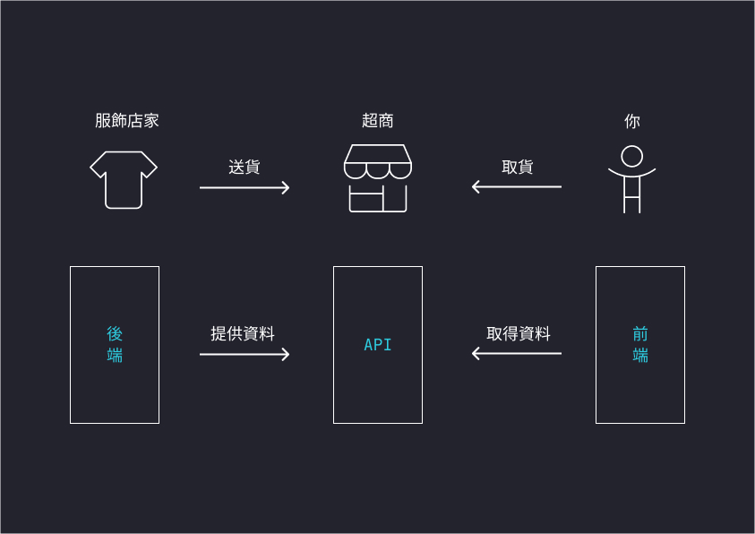

# 甚麼是 API
對於剛接觸的新手來說，API 是一個蠻難懂的概念。其實他蠻簡單的，**前端在獲取資料時，API 通常是一個網址**，前端可以透過這個網址來獲取後端送來的資料。

舉個例子，假設你現在在蝦皮買了一件衣服，要到超商取貨，超商就是一個 API。

在這個例子我們可以看三個部分，**"你"** 到 **"超商"** 取 **"店家發來的貨"**:
1. 你: 前端
2. 超商: API
3. 發貨的店家: 後端、伺服器

換句話說，後端會發送資料到 API，前端可以利用 API 來獲取後端送過來的資料，這就是串接 API。所以 API 就像一個可以取得各種資料的窗口。

有了基本概念之後，我們就可以來更深入的看看 API

## 甚麼是 API?
API 的全名是 「應用程式介面 Application Programming Interface」。

它允許不同的應用程式之間，以規範好的方式進行溝通和互動，即使他們是用不同的語言。就比如前端和後端可以利用 API 來溝通、傳資料。

而規範的方式是可以自訂的，比如後端可以決定前端要傳什麼參數才能取得特定的資料。

## 為甚麼要使用 API?
有了 API 可以大大降低開發人員的負擔，已很常見的例子來說，大部分的電商網站都提供線上刷卡付款，正是因為他們串接了金流公司提供的 API，這樣他們就不需要自行開發一個結帳系統。

在舉一個例子，我們在寫 JS 時的 `setInterval`、`setTimeout` 等都是瀏覽器提供的 API，只要我們遵循它的使用方法，就可以很方便的計時，而不用自己寫一個計時功能的函數，這也是一種 API。

還有最近很流行的 open AI 也有提供 API，讓開發人員可以在自己的應用程式開發想要的 AI 功能，例如客服聊天機器人。

所以說，API 的好處有:
1. 促進程式整合：API 允許不同的程式或服務彼此溝通和互動。這使得系統間的整合變得更容易。就像前面說的購物支付系統。

2. 提高效率和速度：透過使用 API，你可以利用現有的功能和資源，而不需要重新發明輪子。這樣可以節省開發時間和成本。

3. 擴充功能和彈性：你可以利用其他系統的 API，將它們的功能放到你的應用程式中，就像前面說的 AI 機器人。

## 小結
最後總結一下，可以把 API 想像成一個提供特定服務的窗口，這些窗口都會有各自的規範，只要遵循這些規範，就可以使用它們提供的東西。

下次我們就來練習如何串接 API 吧！