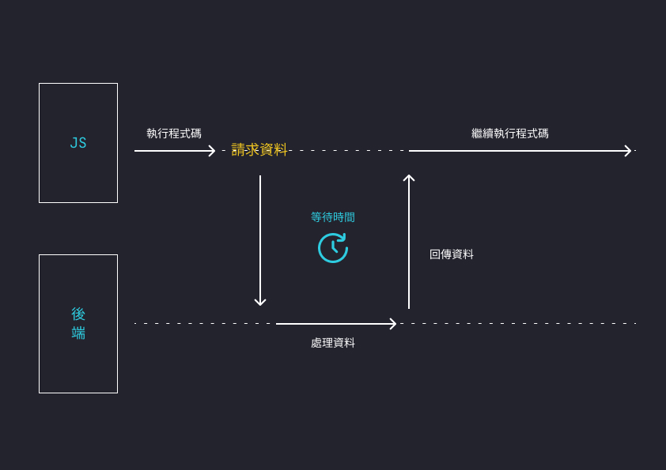
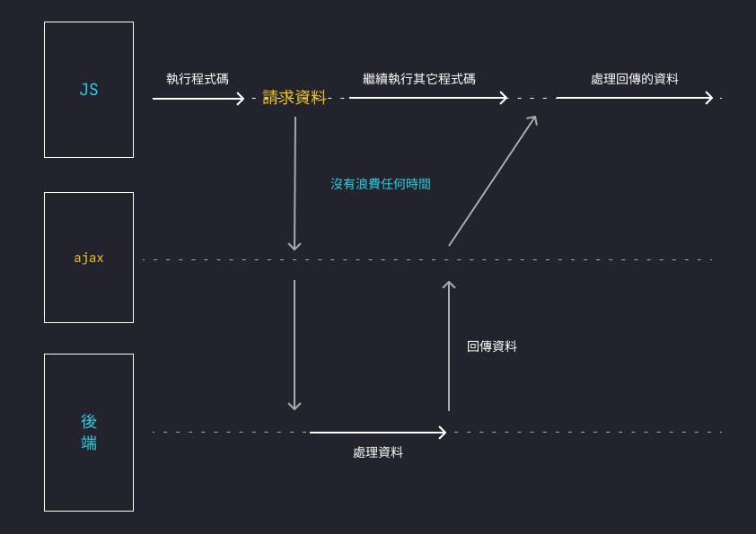
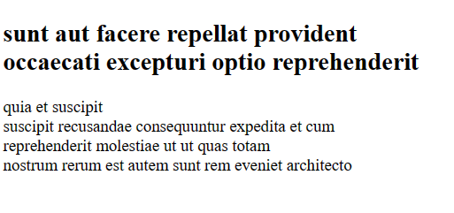

# ajax 是什麼
在上篇文章說到甚麼是 API，而 ajax 就是前端一種用來串接 API 的技術。

在開始介紹 ajax 之前，我們先來看看 ajax 要解決甚麼問題，

## ajax 要解決甚麼問題 ?
在以前沒有 ajax 技術時，若要獲得資料或是傳送資料給後端，網頁需要向後端發送請求，然後等待後端回應，回應後需要**重新載入整個頁面**來完成資料的傳遞，這對於用戶體驗很不好。



而有了 ajax，我們就**不需要重新載入整個頁面**，因為他用到了非同步的概念，將**請求和回應**的部分**交給瀏覽器去非同步處理**，JS 只負責響應結束後，執行指定的回調函數，所以在很多地方都能大大提升用戶的體驗。



## 所以 ajax 是甚麼 ?
ajax 是一個技術，全名叫做 Asynchronous JavaScript and XML，直接翻譯就叫做 **"非同步的 JS 和 XML"**。

XML 是一種用來儲存資料的標記語言，和 JSON 的功能類似，只不過現在更常使用 JSON 格式來儲存資料。因為和 XML 相比，JSON 更簡潔和易於讀寫。

## 如何使用 ajax ?
在 JS 中有提供一個內建的 XMLHttpRequest 物件來時做 ajax，使用方式如下
```js
// 建立 XMLHttpRequest 物件
const xhr = new XMLHttpRequest();

// 監聽是否有回傳資料
xhr.addEventListener('readystatechange', () => {
  if (xhr.readyState === 4 && xhr.status === 200) {
    // 請求完成且成功
    const response = xhr.responseText;
    // 處理伺服器的響應
    console.log(response);
  }
})

// 用 open() 設置發送請求的方法
xhr.open('GET', 'http://example.com/api/data', true);
// 用 send() 發送請求
xhr.send();
```
readyState 代表目前的請求狀態，分成四種
- 0: 還沒開始
- 1: 讀取中
- 2: 已讀取
- 3: 資訊交換中
- 4: 完成

xhr.status 是 HTTP 的狀態碼，200 是成功的意思。

## 實戰練習
我們可以利用網路上提供的免費 api 來練習。JSONplaceholder 就是其中一個免費的 api，他提供各種假資料讓我們免費串接和練習。

你可以上網查詢看看喔！我們今天就用它其中的一個 api 練習，

這是我們要用的 api 位置 : <a href="https://jsonplaceholder.typicode.com/posts/1" target="_blank">https://jsonplaceholder.typicode.com/posts/1</a>

把 open() 裡的網址換掉就可以了！

```html
<h1 class="title"></h1>
<p class="content"></p>
```

```js
const title = document.querySelector('.title');
const content = document.querySelector('.content');

// 建立 XMLHttpRequest 物件
const xhr = new XMLHttpRequest();

// 監聽是否有回傳資料
xhr.addEventListener('readystatechange', () => {
  if (xhr.readyState === 4 && xhr.status === 200) {
    // 請求完成且成功
    const response = xhr.responseText;

    // 將回傳的資料轉換成可以使用的 JS 物件
    const json = JSON.parse(response);
    // 將獲得的 title 和 body 給頁面
    title.innerText = json.title;
    content.innerText = json.body;
  }
})

// 用 open() 設置發送請求的方法
xhr.open('GET', 'https://jsonplaceholder.typicode.com/posts/1', true);
// 用 send() 發送請求
xhr.send();
```
成果 👇



## 小結

從上面就可以發現 XMLHttpRequest 的寫法非常複雜，而且若是有錯誤發生要處理，也非常麻煩，我們可能要寫很多 `if-else` 來判斷是哪裡錯誤，所以不管是 JQuery 還是 ES5 之後新增的 fetch 都是重新封裝 XMLHttpRequest 來讓其寫法更簡潔，下篇就來介紹更好用的 fetch 吧！