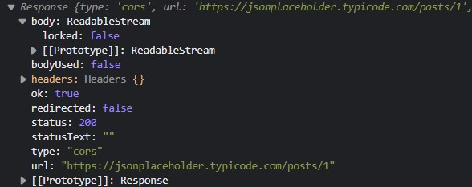
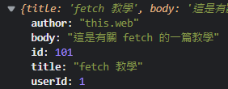

# 如何用 fetch 串接 api

上次用 JS 內建的 XMLHttpRequest 串接 api，但因為過程很麻煩，所以後來 JS 提供了新的串接方式，也就是 fetch！
今天來試著實戰用 fetch 串接 api 吧！

## 甚麼是 fetch
fetch　是原生 js 提供的函數，他可以很方便的去串接 api
那甚麼是 api 呢？　
簡單說就是伺服器提供一個位置，讓前端可以去取得後端的資料，而這個位置通常是一個網址。

網路上有很多免費的 api 可以讓我們練習從前端拿到後端的資料。
我們今天一樣使用 JSONplaceholder 來練習，他提供假資料讓我們免費獲取和練習。

開始前，我們先來了解一下 fetch 要如何使用。

## fetch 的基本使用
fetch 的語法非常簡單。
```js
fetch(url, [options])
  .then((res) => console.log(res))
```
url: 後端提供的接口位置
options: 可選，串 api 時的一些設定
如果沒有設定 options，fetch 就會自動以 get 的方式取得資料。

我們來用 JSONplaceholder 提供的網址來實戰練習看看(可以到他的網站看看他提供的 api 地址)。
```js
fetch('https://jsonplaceholder.typicode.com/posts/1')
  .then((response) => console.log(response));
```
fetch 會回傳一個 Promise，所以我們可以用 `.then()` 來取得資料，忘記 Promise 的趕快去複習。

而 response 通常代表是後端回傳的結果。



這是它回傳回來的資料，我們先不用全部看懂，只要先知道真正的資料在 body 裡面，不過 body 為甚麼寫 ReadableStream 呢？

是因為 fetch 為了更好的效能，它不會一次讀取全部的數據才回傳，而是逐塊讀取數據，然後存在 ReadableStream 裡面，所以我們需要用某些方法將資料解析出來。

最常使用的方式是 `response.json()`，它會將資料自動解析成 json 格式，json 就像 js 的物件，所以解析成 json 後，我們就可以像操作 JavaScript 物件一樣獲取數據。

```js
fetch('https://jsonplaceholder.typicode.com/posts/1')
  .then((response) => response.json())
  .then((json) => console.log(json));

  /*
    {
      "body" : "quia et suscipit...",
      "id" : 1,
      "title" : "sunt aut ...",
      "userId" : 1
    }
  */
```
可以看到他回傳的是一篇假文章，此時我們就可以像這樣去獲取文章的內容和標題。

```html
<h2 class="title"></h2>
<p class="body"></p>
```

```js
const title = document.querySelector('.title');
const body = document.querySelector('.body')

fetch('https://jsonplaceholder.typicode.com/posts/1')
  .then((response) => response.json())
  .then((json) => {
    title.innerText = json.title;
    body.innerText = json.body;
  });
```
成果 👇


## 如何在 get 方法中帶入參數
有時候我們會要傳入一些參數來獲取特定的資料，例如我們想取得 id = 2 的文章，就可以像這樣使用：
```js
function getData(id) {
  fetch(
    `https://jsonplaceholder.typicode.com/posts?${new URLSearchParams({
      id: id
    })}`
  )
    .then((response) => response.json())
    .then((json) => console.log(json));
}

getData(2);
```
`new URLSearchParams()` 可以將物件轉換成查詢參數，像是這樣
```js
const params = { name: 'Jack', age: 25 };

const searchParams = new URLSearchParams(params);
console.log(searchParams.toString());
// name=Jack&age=25
```

## fetch 的選項
除了像上面那樣基本的取得資料，fetch 還提供第二個參數可以調整一些參數，例如將 method 改為 post。

post 可以將前端的資料回傳給伺服器，我們一樣可以用 JSONplaceholder 來練習 post。
```js
fetch('https://jsonplaceholder.typicode.com/posts', {
  method: 'POST',
  body: JSON.stringify({
    title: 'fetch 教學',
    body: '這是有關 fetch 的一篇教學',
    author: 'this.web',
    userId: 1,
  }),
  headers: {
    'Content-type': 'application/json',
  },
})
  .then((response) => response.json())
  .then((json) => console.log(json));
```
* method: api 請求的方法，例如 GET、POST、PUT、DELETE 等
* body: 傳送的資料主體
* headers: 請求頭，放一些有關於請求的相關訊息
  * 像這裡的 `'Content-type': 'application/json'` 是指定伺服器回傳的資料為 json 格式

我們 post 資料給伺服器後，它會回傳一些資料讓我們判斷我們是否有 post 成功，所以最後也要用 `.then()` 來檢查。



可以發現它回傳了我們 post 的內容，這樣就可以判斷後端是否有接收到正確的內容了。

## fetch 的錯誤處理
有時候我們不會那麼順利，可能在請求時發生一些預料外的錯誤，但發生錯誤時，fetch 不會自動發現，需要我們手動的去判斷，這也是 fetch 的小缺點。

通常可以用 `response.ok` 來判斷是否有成功，我們故意把網址打錯 (/posts 打錯成 /post)。
```js
const post = fetch('https://jsonplaceholder.typicode.com/post/100')
  .then((response) => {
    if (!response.ok) {
      throw new Error(response.status)
    }
    return response.json();
  })
  .then((json) => console.log(json))
  .catch((error) => console.log(error))

  // Error: 404
```
可以發現 `catch` 回傳一個 404，相信 404 大家都不陌生，它是最常見的 http code，每個 http code 都有各自的意思，常見的 http code 如下:

- 2xx 成功：
  - 200 OK：請求成功。
  - 201 Created：請求成功，並創建了新的資源。
  - 204 No Content：請求成功，但沒有返回任何內容。
- 3xx 重定向：
  - 301 Moved Permanently：資源被永久移動到新的位置。
  - 302 Found：資源被臨時移動到新的位置。
  - 304 Not Modified：資源未被修改，可以使用緩存的版本。
- 4xx 客戶端錯誤：
  - 400 Bad Request：請求有誤，服務器無法理解。
  - 401 Unauthorized：請求需要身份驗證。
  - 403 Forbidden：服務器拒絕請求。
  - 404 Not Found：請求的資源不存在。
5xx 服務器錯誤：
  - 500 Internal Server Error：服務器遇到了錯誤。
  - 503 Service Unavailable：服務器暫時無法處理請求。

大家可以稍微記一下喔，這樣才能根據情況做出不同的處理。

## 小結
今天分享了如何用 fetch 來串接 api，你也可以上網找一些免費的 api 來練習，這裡推薦一個可愛的 api -> cat api，他可以獲取一堆貓咪的照片，至於喜歡狗狗的可以搜尋 dog api 來練習！