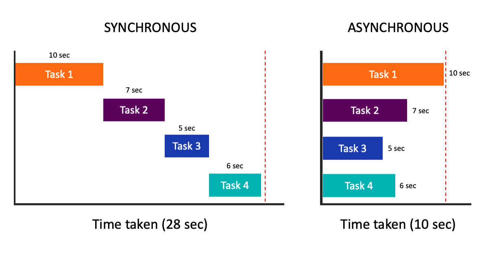

# 期約(Promise)與非同步(異步)函數
在 JS 中我們會使用 setTimeout 來模擬非同步  

## 非同步是什麼？
在開始之前要先理解甚麼是同步，甚麼是非同步  
同步跟非同步的觀念並不是只存在於前端，而是整個電腦科學的領域都會接觸到的東西。且它也不難理解。

同步(Synchronous、sync)：做完一件事情後接著做另一件事情  
相對的  
非同步(Asynchronous、async)：同時做多件事情  
像下面這張圖


舉例來說，你一天的行程可能是    
吃早餐 - 工作 - 吃午餐 - 開會 - 閱讀 - 吃晚餐 - 運動  
過程中你沒辦法做其他事情，例如邊開會邊閱讀，這就是同步，一件事情做完才能做另一件事情  

而非同步就像是你請兩個人幫你工作跟開會，而你可以專心閱讀，就會變成  
吃早餐 - 工作、開會、讀書 - 吃午餐 - 其他事 - 吃晚餐 - 運動  
有沒有發現工作開會讀書一個早上就完成了，效率很高，這就是非同步的優點。

在接觸這個名詞有點容易搞混，以為同步是同時進行很多事情，我也搞混過  
不過這裡的同步是指狀態或資料上面的同步。  

## 同步不同步是指資料或狀態

一樣行程的例子，你閱讀完後隔天可以直接把學到的知識用工作上，因為狀態(資料)同步了。  
但若是非同步的狀況下，你所學到的知識無法即時傳遞給另外兩個人，不可能說你學到了，另外兩個人也會了，這就是資料非同步。

一開始可能需要花點時間適應，不過知道觀念後就不難記了。

## 同步和非同步在程式中的樣子
前面說了一大堆例子，該來進入程式的世界了  

因為非同步的東西什麼時候完成不知道，所以我們在 JS 就常用 setTimeout 模擬非同步的情形  

其實同步在程式的世界裡很好懂，來看看下面的例子
```js
function double(value) {
  console.log(value * 2);
}
let x = 3;
double(x);
console.log(x + 1)
// 6
// 4
```
同步就是每行程式碼都會依照順序執行，先宣告 x 後，執行 double()，再打印 x + 1

而非同步就會是這樣
```js
function double(value) {
  setTimeout(() => console.log(value * 2), 1000);
}
let x = 3;
double(x); 
console.log(x + 1);
// 4
// 6
```
就算 double(x) 再 x + 1 前面  
還是會先打印出 4  
一秒後才打印出 6 


## 甚麼情況要用到非同步
我們經常需要去後端提供的接口來取得資料(也就是所謂的 API串接)    
如果我們等到資料全部取得完才顯示頁面，就會拖太久讓體驗不好  
這時就可以用到非同步的觀念
```js
function getSomeData(url) {
  // ...
}

getSomeData(url)

// other operation
```
像上面的程式碼  
getSomeData(url) 是去後端提供的網址取得資料
(先不管是如何取得的)
同時我們也可以處理其他運算(other operation)

## 若要用到非同步的返回值該怎麼辦？
有時候我們會需要用到非同步的返回值，但因為我們不確定它什麼時候會把資料送回來  
所以可以利用回調函數(callback)，並且這個callback要使用非同步返回的值作為參數  

```js

function getSomeData(url, callback) {
  // ...

  callback(yourData);
}

getSomeData(url1, (data1) => { 
  console.log(data1)
  getSomeData(data1.url)
})

// other operation
```
例如上面  
送回來的資料又有一個網址  
而我們又剛好需要去這個網址拿其它資料  
就可以利用回調函數來實現

## 回調函數的問題
看起來很美好的回調函數其實有個大問題  
若我們又要去拿第三個資料，甚至第四、五個   
就會變成
```js
function getSomeData(url, callback) {
  // ...

  callback(yourData);
}

getSomeData(url1, (data1) => { 
  console.log(data1);
  getSomeData(data1.url, (data2) => {
    console.log(data2);
    getSomeData(data2.url, (data3) => {
      console.log(data3);
      getSomeData(data3.url, (data4) => {
        ...
      })
    });
  })
})

// other operation
```
我們會一直用回調函數  
讓程式碼變得難看又難維護  
這也是所謂的回調地獄(callback hell)

為了解決這個問題，JS 後來才增加了 Promise 和 async/await 來幫助我們  
那這些就之後再聊啦，希望今天能讓你對非同步有一個大致的認識 


補充：異步一定在同步之後執行  
就算定時器設定 0 毫秒
```js
let a = 10; 
setTimeout(() => {
  a++;
}, 0)
console.log(a)
// 10
```
所以在同步的程式碼是碰不到異步的程式碼的 

# Promise
