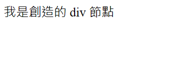
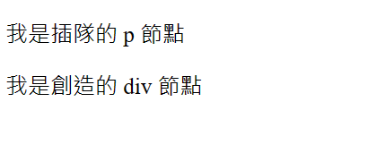

# DOM 節點 (DOM node)
在了解到甚麼是 DOM 以及如何獲取、修改 DOM 後，就可以來看看如何增加或刪除 DOM 了！

不過在開始之前，我們要先了解一下 DOM 節點的概念，因為增加 DOM 的時候，要選取節點並決定要在節點前還是節點後增加。

## DOM 節點是甚麼
DOM 節點是指 DOM 中的一個元素，例如下圖:


圖中的每一個框框都是一個 DOM，你可以看出 DOM 節點有很多種類型，平常使用 `document.querySelector()` 獲得的東西，就是 DOM 元素節點。

所以簡單說，**DOM 節點是 DOM 中的基本單位，它代表著網頁中的一個元素或一個節點**。

## DOM 節點的種類
DOM 節點可以分為:
1. 元素節點 (Element Node): head、body、div…
2. 文本節點 (Text Node): 通常是元素節點裡面包的文字內容，**包含空格、換行**
3. 屬性節點 (Attribute Node): 寫在標籤上的屬性，像 id、class、style、href ...等等
4. 注釋節點 (Comment Node):  HTML 中的注釋，即以 <!-- 開始、以 --> 結束的文字。
5. 根結點 (document)、根元素節點(html)


而每一個節點跟其它節點的關係又可以分為:
1. 子節點
2. 父節點
3. 兄弟節點


再拿同一張圖來舉例，`body` 節點就有 `a`、`h1` 2 個子節點；而 `a` 只有一個兄弟節點 `h1`。

`a` 旁邊的屬性節點比較特別一點，他並不是兄弟節點喔，只是跟 `a` 元素有相關的節點。

### 子節點 childNodes、children
一個元素可以包含其他元素，被包含的元素就是該元素的子元素，相對地，該元素就是子元素的父元素。

要注意的是，子節點可以是元素節點、文本節點或注釋節點喔。

我們可以使用 `childNodes` 屬性來獲取一個節點的所有子節點，或使用 `children` 來獲取所有的**子元素節點**

```jsx
<div class="myDiv">
  Hello,
  <span>World!!!</span>
</div>

const myDiv = document.querySelector('.myDiv');
console.log(myDiv.childNodes) // NodeList(3) [text, span, text]
console.log(myDiv.children) // HTMLCollection [span]
```

或使用 `firstChild` 和 `lastChild` 屬性來獲取第一個和最後一個子節點。
以及 `firstElementChild` 和 `lastElementChild` 獲取第一個和最後一個子元素節點

### 父節點 parentNode、parentElement
每個節點都有一個父節點，使用 parentNode 屬性可以獲取一個節點的父節點。而 `parentElement` 獲取元素父節點。

```jsx
<div class="myDiv">
  Hello,
  <span class="mySpan">World!!!</span>
</div>

const mySpan = document.querySelector('.mySpan');
console.log(mySpan.parentNode) // div.myDiv
console.log(mySpan.parentElement) // div.myDiv
```
可以發現結果一樣，那是因為 Hello 並不是 mySpan 的父節點，而是兄弟節點喔。

### 兄弟節點 Sibling
一個節點可以有多個兄弟節點，兄弟節點是指與該節點**具有相同父節點**的其他節點。可以使用 `nextSibling` 和 `previousSibling` 屬性來獲取下一個和上一個兄弟節點。也一樣，可以使用 `nextElementSibling`、`previousElementSibling` 獲取兄弟元素節點。

```js
<div class="myDiv">
  Hello,
  <span class="mySpan">World!!!</span>
</div>

const mySpan = document.querySelector('.mySpan');
console.log(mySpan.previousSibling) // #text
```


## 添加 DOM 節點
在我們認識節點之間彼此的關係後，就可以試著來增加節點了。

### document.createElement(tagName) 創造節點
我們可以使用 `document.createElement(tagName)` 方法可以創建一個新的元素節點，其中 tagName 是元素的標籤名稱，例如 div、p、span 等等。例如創造一個 div 元素，並修改其中的內文:

```js
let divElement = document.createElement('div');
divElement.innerText = '我是創造的 div 節點';
```

### parentNode.appendChild(newNode)
接著要使用 parentNode.appendChild(newNode) 方法，將剛剛創造的節點添加為某個節點的子節點。

其中 `parentNode` 是父節點，`newNode` 是要添加的新節點。該方法會將新節點添加到父節點的子節點列表的**末尾**。

我們延續上面的程式碼:

```js
let divElement = document.createElement('div');
divElement.innerText = '我是創造的 div 節點';
document.body.appendChild(divElement);
```
可以發現頁面中多了一個 div 元素！



### parentNode.insertBefore(newNode, referenceNode)
除了使用 `appendChild()` 添加子元素到父元素的尾端，也可以用 `insertBefore()` 來指定添加的位置。他會將元素添加到 `referenceNode` 前面喔！
其中 `parentNode` 是父節點，`newNode` 是要添加的新節點，`referenceNode` 是要將新節點插入到其前面的節點：

```js
let divElement = document.createElement('div');
divElement.innerText = '我是創造的 div 節點';
document.body.appendChild(divElement);

let pElement = document.createElement('p');
pElement.innerText = '我是插隊的 p 節點';
document.body.insertBefore(pElement, divElement);
```


### node.cloneNode 複製節點
除了自己創造節點，我們也可以複製節點。

使用 `node.cloneNode()` 方法可以複製一個節點，其中 node 是要複製的節點。複製的節點是該節點的一個副本，可以使用其他方法將其添加到網頁中。

例如，以下程式碼可以複製一個網頁中已有的 div 元素，並將其添加為 body 元素的子元素：
```js
let originalDivElement = document.querySelector('div');
let clonedDivElement = originalDivElement.cloneNode(true);
document.body.appendChild(clonedDivElement);
```

## removeChild 刪除節點
如果想刪除節點，可以使用 `parentNode.removeChild(node)` ，這個方法可以將**某個節點的子節點刪除**，其中 parentNode 是父節點，node 是要刪除的子節點。

例如，以下可以刪除網頁中已有的一個 div 元素：
```js
let divElement = document.querySelector('div');
document.body.removeChild(divElement);
```
如果想要刪除自己，可以搭配 parentNode 屬性來實現:

```js
let divElement = document.querySelector('div');
divElement.parentNode.removeChild(divElement);
```

## 小結
今天講了如何 DOM 結點的觀念，也知道了如何增加和刪除 DOM 了，下一篇我們來聊聊**事件**吧，事件是非常重要的東西喔！學會事件之後，我們就可以嘗試製作我們第一款的網頁程式了！


## 參考
<a href="https://www.w3schools.com/js/js_htmldom.asp" target="_blank">W3School - DOM</a> 